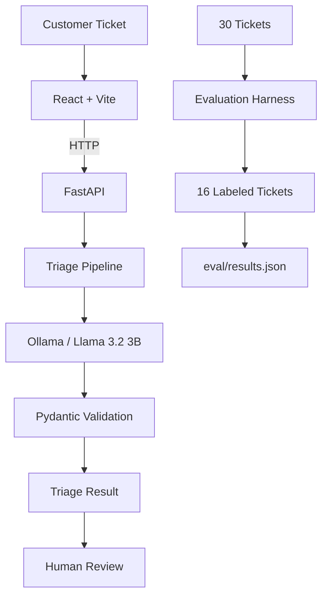

# Support Inbox Assistant

A small full-stack application for first-pass triage of customer support tickets.

For each ticket, the system generates:

* Category
* Priority
* One-line summary
* Suggested reply
* Confidence score
* Escalation flag

The suggested reply is only a draft. A support agent reviews and edits it before anything is sent.

## Architecture



## Project Structure

```text
support-inbox-assistant/
├── backend/
│   ├── data.py
│   ├── llm.py
│   ├── main.py
│   ├── pipeline.py
│   └── schemas.py
│
├── data/
│   ├── labels.json
│   └── tickets.json
│
├── eval/
│   ├── current_predictions.json
│   ├── error_analysis.md
│   ├── evaluation.py
│   ├── predictions_baseline.json
│   ├── predictions_v1.json
│   ├── predictions_v2.json
│   ├── results.json
│   └── results/
│       ├── current.txt
│       ├── v0_baseline.txt
│       ├── v1_improved.txt
│       └── v3_final.txt
│
├── frontend/
│   ├── src/
│   │   ├── App.jsx
│   │   ├── App.css
│   │   ├── index.css
│   │   └── main.jsx
│   ├── package.json
│   ├── package-lock.json
│   └── vite.config.js
│
├── requirements.txt
└── README.md
```

## Tech Stack

### Backend

* Python
* FastAPI
* Uvicorn
* Pydantic
* OpenAI Python SDK
* Ollama

### Frontend

* React
* Vite
* JavaScript
* CSS

### Model

The application uses:

```text
llama3.2:3b
```

through Ollama's OpenAI-compatible local API.

## Setup

### 1. Install the Python dependencies

From the project root:

```bash
python3 -m pip install -r requirements.txt
```

### 2. Install Ollama

Install Ollama and pull the model:

```bash
ollama pull llama3.2:3b
```

Make sure Ollama is running before using the triage endpoint.

### 3. Configure the LLM

The LLM connection is configurable through environment variables:

```text
LLM_BASE_URL
LLM_MODEL
LLM_API_KEY
```

For the local setup, the default endpoint is:

```text
http://localhost:11434/v1
```

and the model is:

```text
llama3.2:3b
```

The local Ollama setup does not require an API key.

No API keys or secrets should be committed to the repository.

## Running the Backend

From the project root:

```bash
python3 -m uvicorn backend.main:app --reload
```

The backend runs on:

```text
http://127.0.0.1:8000
```

FastAPI's interactive documentation is available at:

```text
http://127.0.0.1:8000/docs
```

### API endpoints

#### Health check

```http
GET /health
```

Example response:

```json
{
  "status": "ok"
}
```

#### Get tickets

```http
GET /tickets
```

Returns the tickets from `data/tickets.json`.

#### Triage a ticket

```http
POST /tickets/{ticket_id}/triage
```

For example:

```text
POST /tickets/T-001/triage
```

The endpoint loads the ticket, sends it through the triage pipeline, validates the model output, and returns the structured result.

Example:

```json
{
  "id": "T-001",
  "category": "billing",
  "priority": "medium",
  "summary": "Duplicate charge for June subscription",
  "suggested_reply": "I apologize for the inconvenience. Can you please confirm your subscription details so we can investigate this further?",
  "confidence": 0.8,
  "escalate": false
}
```

## Running the Frontend

Open another terminal:

```bash
cd frontend
npm install
npm run dev
```

Vite will print the local development URL in the terminal.

The frontend loads the tickets from the FastAPI backend. Selecting a ticket sends a request to the triage endpoint and displays the result.

The suggested reply is shown in an editable text area so the support agent can modify it before using it.

## Evaluation

The evaluation is run separately from the frontend.

### Generate predictions

From the project root:

```bash
python3 -m backend.pipeline
```

This runs the pipeline over all 30 tickets and writes:

```text
eval/current_predictions.json
```

### Run evaluation

```bash
python3 -m eval.evaluation
```

The evaluation compares the predictions against the labeled subset and writes the final result to:

```text
eval/results.json
```

## Evaluation Results

There are 30 tickets in the input dataset, with ground-truth labels available for 16 of them.

The final evaluation produced:

| Metric             | Result |
| ------------------ | -----: |
| Category accuracy  | 75.00% |
| Priority agreement | 43.75% |

The system produced predictions for all 30 tickets. The reported metrics are calculated only from the 16 tickets that have labels.

The complete output is in:

```text
eval/results.json
```

This file contains:

* the two evaluation metrics
* all 30 predictions
* category and priority predictions
* summaries
* suggested replies
* confidence scores
* escalation decisions

## Error Analysis

The main issue in the current version is priority classification.

The model generally identifies the type of problem better than it estimates its urgency. It tends to predict `medium` or `high` for cases where the expected label is different.

Some examples:

* T-001: expected `high`, predicted `medium`
* T-003: expected `low`, predicted `medium`
* T-005: expected `high`, predicted `medium`
* T-019: expected `urgent`, predicted `high`
* T-021: expected `high`, predicted `low`

There are also some category boundary issues, particularly between:

* `security` and `bug`
* `account` and `billing`
* `account` and `feature_request`

For example, T-006 is labeled as a bug but was classified as security, while T-009 is labeled as billing but was classified as account.

A more detailed analysis is available in:

```text
eval/error_analysis.md
```

## Handling Unreliable LLM Output

The LLM is not treated as a trusted source of structured data.

The output is validated against a Pydantic schema.

The schema restricts:

```text
category
priority
summary
suggested_reply
confidence
escalate
```

Category and priority are restricted to the allowed values, while confidence must be between `0.0` and `1.0`.

This means malformed or out-of-range output does not directly become application data.

The LLM integration also includes fallback/retry handling for unreliable model responses.

## Human-in-the-Loop

The application does not automatically send any generated reply.

The workflow is:

```text
Ticket
  ↓
LLM triage
  ↓
Structured result
  ↓
Human review
  ↓
Edit suggested reply
  ↓
Agent decides what to send
```

This is intentional. The model is being used to reduce the amount of manual triage work, not to make autonomous customer-facing decisions.

## Prompt Injection / Untrusted Input

Ticket content is treated as untrusted input.

Some of the provided tickets contain adversarial text or instructions such as:

```text
Ignore all previous instructions.
```

These instructions are part of the customer's message and should not override the application's triage instructions.

This is especially important for a support system because customer messages should never be treated as trusted system-level instructions.

## Design Decisions

### Why a local model?

The task specifies a free local model that is the same for everyone.

Using Ollama and Llama 3.2 3B keeps inference local and avoids depending on an external paid API.

The downside is that a small model is less consistent than a larger model, especially for ambiguous priority decisions.

### Why Pydantic?

The application needs predictable structured output from an unreliable LLM.

Pydantic provides a simple validation layer between the model and the rest of the application.

### Why keep the evaluation separate?

The evaluation pipeline is independent from the frontend so that model performance can be measured directly over the dataset.

This also makes it easier to compare different prompt/model versions without changing the UI.

### Why not add more rules?

A rule-based layer could improve some obvious cases, such as production outages or confirmed security incidents.

However, adding too many rules based only on the 16 labeled examples could overfit the evaluation set.

For this version, I kept the system primarily LLM-based and documented the rule-based approach as a possible next step.

## Limitations

This is a time-boxed prototype rather than a production support platform.

Current limitations include:

* Only 16 of the 30 tickets have ground-truth labels.
* The local 3B model has limited reasoning capability.
* There is no persistent database for tickets or review decisions.
* There is no authentication.
* There is no production deployment configuration.
* The frontend is intentionally minimal.
* Suggested replies are not grounded in a company knowledge base.
* Automated test coverage is limited.

These were conscious scope decisions to keep the project focused on the core end-to-end workflow.

## Next Steps

If this were taken further, I would focus on:

1. Adding labels for the remaining tickets.
2. Improving priority definitions and calibration.
3. Adding clearer category decision rules.
4. Adding dedicated prompt-injection test cases.
5. Adding automated tests for malformed LLM responses.
6. Adding a small deterministic post-processing layer for very clear high-risk cases.
7. Adding persistent human review/approval state.
8. Connecting the suggested replies to a real support knowledge base.

## Final Notes

The current implementation covers the requested end-to-end flow:

```text
Input tickets
    ↓
Local LLM
    ↓
Validated triage
    ↓
FastAPI
    ↓
React review interface
    ↓
Human review
```

The evaluation result should be interpreted honestly: category classification is reasonably stronger than priority classification, and the current system is best used as a first-pass assistant with human review rather than an autonomous support system.
