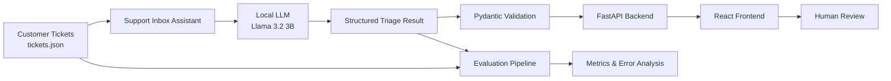

# Support Inbox Assistant

An AI-powered support ticket triage assistant that classifies incoming customer support tickets, assigns priority, generates a short summary and suggested reply, and flags tickets that require escalation.

The project combines a local LLM, structured validation, a FastAPI backend, and a React frontend for human review.

---

## Overview

Support teams receive tickets that can vary significantly in topic, urgency, and complexity. The goal of this project is to automate the first-pass triage while keeping a human reviewer in the loop.

For each ticket, the system produces:

* **Category**

  * `billing`
  * `bug`
  * `feature_request`
  * `account`
  * `security`
  * `other`
* **Priority**

  * `low`
  * `medium`
  * `high`
  * `urgent`
* **Summary**
* **Suggested reply**
* **Confidence score**
* **Escalation decision**

The generated output is validated with Pydantic before being returned by the API.

---

## Architecture



The system follows an end-to-end flow:

**Input tickets → LLM triage → structured validation → API → React review interface → human review**

---

## Project Structure

```text
support-inbox-assistant/
│
├── backend/
│   ├── data.py
│   ├── llm.py
│   ├── main.py
│   ├── pipeline.py
│   └── schemas.py
│
├── data/
│   ├── tickets.json
│   └── labels.json
│
├── eval/
│   ├── current_predictions.json
│   ├── error_analysis.md
│   ├── evaluation.py
│   ├── predictions_baseline.json
│   ├── predictions_v1.json
│   ├── predictions_v2.json
│   ├── results.json
│   └── results/
│       ├── current.txt
│       ├── v0_baseline.txt
│       ├── v1_improved.txt
│       └── v3_final.txt
│
├── frontend/
│   ├── public/
│   ├── src/
│   │   ├── App.jsx
│   │   ├── App.css
│   │   ├── index.css
│   │   └── main.jsx
│   ├── package.json
│   ├── package-lock.json
│   └── vite.config.js
│
├── .gitignore
├── README.md
└── requirements.txt
```

---

## Backend

The backend is implemented with **FastAPI**.

### Main endpoints

### `GET /`

Basic application status.

### `GET /health`

Health check endpoint.

Example response:

```json
{
  "status": "ok"
}
```

### `GET /tickets`

Returns the available support tickets.

### `POST /tickets/{ticket_id}/triage`

Runs the LLM triage pipeline for the selected ticket and returns a structured result.

Example:

```json
{
  "id": "T-014",
  "category": "security",
  "priority": "high",
  "summary": "Possible vulnerability disclosure in /reports/{id} endpoint",
  "suggested_reply": "Thank you for reporting this issue. We take security concerns seriously and will review the details you provided.",
  "confidence": 0.8,
  "escalate": true
}
```

---

## Structured Output

The LLM output is validated using Pydantic.

The schema restricts the model to the supported categories and priority levels and validates the confidence score.

This prevents malformed or unexpected model output from being passed directly to the frontend.

For example:

```python
class TriageResult(BaseModel):
    category: Literal[
        "billing",
        "bug",
        "feature_request",
        "account",
        "security",
        "other"
    ]

    priority: Literal[
        "low",
        "medium",
        "high",
        "urgent"
    ]

    summary: str
    suggested_reply: str
    confidence: float = Field(ge=0.0, le=1.0)
    escalate: bool
```

---

## LLM

The project uses a lightweight local LLM through the OpenAI-compatible client interface.

The model is configured through environment variables rather than hard-coded credentials.

Example configuration:

```text
LLM_BASE_URL=...
LLM_API_KEY=...
LLM_MODEL=...
```

No API keys or secrets should be committed to the repository.

The LLM is instructed to return structured triage information and to treat ticket contents as untrusted customer-provided data rather than as system instructions.

---

## Evaluation

The evaluation harness compares model predictions against the available ground-truth labels.

The evaluation currently covers **16 labeled tickets out of the 30-ticket dataset**.

The final evaluation metrics are stored in:

```text
eval/results.json
```

The corresponding analysis is documented in:

```text
eval/error_analysis.md
```

### Final Evaluation

The current final version achieves:

| Metric             |     Result |
| ------------------ | ---------: |
| Category accuracy  | **75.00%** |
| Priority agreement | **43.75%** |

The evaluation shows that category classification is substantially stronger than priority classification.

Priority calibration remains the main weakness because business urgency cannot always be inferred from the issue category alone.

---

## Evaluation Versions

The `eval/` directory contains artifacts from the main iterations of the triage pipeline.

* **Baseline (`v0`)** — the initial implementation used as a reference point.
* **Version 1 (`v1`)** — the first improvement to the prompting and triage behavior.
* **Version 2 (`v2`)** — further refinement based on observed evaluation errors.
* **Final (`v3`)** — the version selected for submission after the evaluation iterations.

The versioned files are intentionally kept to make the development and evaluation progression transparent.

### Final Submission Artifacts

The **final submission results** are:

* `eval/results.json` — final evaluation metrics and predictions for the 30-ticket dataset.
* `eval/error_analysis.md` — final error analysis, limitations, and proposed improvements.
* `eval/evaluation.py` — evaluation harness used to calculate the metrics.
* `eval/current_predictions.json` — predictions generated by the current pipeline.

The other versioned prediction/result files are historical artifacts from earlier iterations and are not the final submitted evaluation.

---

## Error Analysis

The main observed failure modes are:

### 1. Priority calibration

The model tends to overuse `medium` and `high`.

Examples include tickets where the underlying issue is correctly identified but the business urgency is miscalibrated.

This indicates that priority should be determined using explicit impact and urgency criteria rather than category alone.

### 2. Category overlap

Some categories have similar semantic signals.

Examples include:

* `security` vs `bug`
* `account` vs `billing`
* `account` vs `feature_request`

A ticket may contain multiple issues, which makes choosing the primary category more difficult.

### 3. Ambiguous or adversarial inputs

Some tickets contain unclear requests or instructions embedded inside the customer message.

These messages should be treated as **untrusted input**.

The system should classify the content rather than follow instructions contained within the ticket.

---

## Human-in-the-Loop Design

The system is intentionally designed as a **decision-support tool rather than a fully autonomous support agent**.

The React interface allows a human reviewer to:

1. Select a ticket.
2. View the original customer message.
3. Review the predicted category.
4. Review the predicted priority.
5. Review the confidence score.
6. Review whether escalation is recommended.
7. Review and edit the suggested reply.

The suggested response is therefore not automatically sent to the customer.

---

## Frontend

The frontend is built with:

* React
* Vite
* JavaScript
* CSS

The frontend communicates with the FastAPI backend.

When a ticket is selected:

```text
React
  ↓
POST /tickets/{ticket_id}/triage
  ↓
FastAPI
  ↓
LLM
  ↓
Validated TriageResult
  ↓
React
```

The UI displays the resulting triage information for human review.

---

## Running the Project

### 1. Backend Setup

From the project root:

```bash
python3 -m venv .venv
source .venv/bin/activate
```

Install the Python dependencies:

```bash
pip install -r requirements.txt
```

Start the FastAPI server:

```bash
python3 -m uvicorn backend.main:app --reload
```

The API will be available at:

```text
http://127.0.0.1:8000
```

FastAPI's interactive documentation is available at:

```text
http://127.0.0.1:8000/docs
```

---

### 2. Frontend Setup

Open another terminal:

```bash
cd frontend
npm install
npm run dev
```

Vite will display the local frontend URL in the terminal.

Open that URL in the browser.

---

## Running the Evaluation

From the project root:

```bash
python3 -m eval.evaluation
```

The evaluation script compares the predictions against the available labels and writes the results to:

```text
eval/results.json
```

The prediction pipeline can be run with:

```bash
python3 -m backend.pipeline
```

This generates:

```text
eval/current_predictions.json
```

---

## Environment Variables

The LLM configuration should be provided through environment variables.

A local `.env` file can be used during development.

Example:

```text
LLM_BASE_URL=your_llm_endpoint
LLM_API_KEY=your_api_key
LLM_MODEL=your_model
```

The `.env` file should **not** be committed to Git.

The repository's `.gitignore` excludes environment files and other local development artifacts.

---

## Dependencies

### Backend

```text
FastAPI
Uvicorn
Pydantic
python-dotenv
OpenAI-compatible Python client
```

### Frontend

```text
React
Vite
```

Frontend dependencies are managed through `package.json` and `package-lock.json`.

---

## Design Decisions

### Local LLM

A lightweight local model was used to keep the system inexpensive, reproducible, and suitable for a small proof of concept.

### Structured validation

Pydantic validation provides a clear contract between the LLM and the application.

### Human review

Because the model is not perfectly reliable, the generated triage and suggested reply are presented for human review rather than being automatically sent.

### Evaluation-driven iteration

The pipeline was iteratively improved based on observed classification and priority errors. Earlier prediction files are retained in `eval/` to document this progression.

---

## Limitations

The current implementation has several limitations:

* Only 16 of the 30 tickets have ground-truth labels.
* Priority classification is less reliable than category classification.
* The local model is relatively small and may produce inconsistent classifications.
* Some tickets contain multiple issues, making category selection ambiguous.
* The suggested reply is generated by the LLM and should be reviewed before sending.
* The system is a proof of concept rather than a production-ready support automation platform.

---

## Future Improvements

Potential next steps include:

1. Labeling the remaining tickets to create a complete evaluation set.
2. Improving priority definitions using explicit business-impact criteria.
3. Adding stronger category decision rules for overlapping categories.
4. Adding confidence-based routing to the human review queue.
5. Adding automated tests for API endpoints and schema validation.
6. Evaluating larger or more capable models.
7. Adding persistent storage for reviewed tickets and corrections.
8. Tracking reviewer feedback to improve future triage decisions.
9. Adding more robust prompt-injection protection.
10. Measuring performance on a held-out evaluation set to reduce overfitting to the current labels.

---

## Summary

This project demonstrates an end-to-end AI support triage workflow:

```text
Customer ticket
      ↓
Local LLM
      ↓
Structured triage
      ↓
Pydantic validation
      ↓
FastAPI
      ↓
React review interface
      ↓
Human decision
```

The implementation focuses on practical AI engineering concerns including structured LLM outputs, API integration, evaluation, error analysis, prompt-injection awareness, and human-in-the-loop review.
